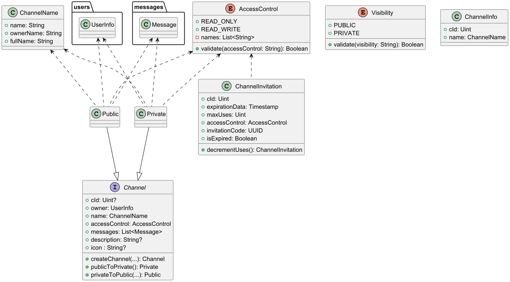

# Conceptual module
The following diagram illustrates the Entity-Relationship for the information represented by the system.

## Domain

### Model

The following UML diagrams represent the primary entities of the system.

---

#### Channels

- This UML diagram represents channels, which are the primary entities of the system. They serve as the main means of communication between users.

---

#### Messages

- This UML diagram represents messages, which facilitate communication between users.

---

#### Users

- This UML diagram represents users, the entities that utilize the system.

---

### Errors

- This UML diagram represents errors, which are used to depict issues that occur within the system.

---

## Services

### Interfaces

- This UML diagram represents the interfaces defined within the service module.

---

### Services

- This UML diagram represents the services implemented within the service module.

---

## Repository

- This UML diagram represents the repositories implemented within the repository module.

---

## Repository JDBC

- This UML diagram represents the repositories implemented within the repository_jdbc module.

---

## HTTP API

### Controllers

- This UML diagram represents the controllers implemented within the HTTP API module.

---