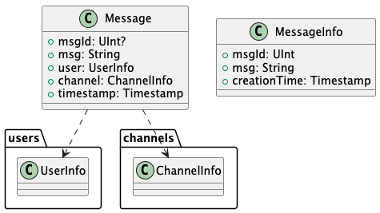
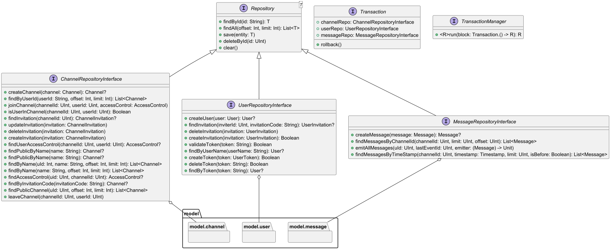

# Conceptual module
The following diagram holds the Entity-Relationship for the information represented by the system.
## Domain
### model
The following umls represents the main entities of the system.

---
#### channels
- This uml represents channels, which are the main entities of the system. They are the main way to communicate with other users.

---
#### messages
- This uml represents messages, which is how users communicate with each other.

---
#### users
- This uml represents users, which are the entities that use the system.

---

### errors
- This uml represents errors, which are the entities that are used to represent errors that occur in the system.

---
## Services
### interfaces
- This uml represents the interfaces that are defined on service module.

---
### services
- This uml represents the services that are implemented on service module.

---

## Repository
- This uml represents the repositories that are implemented on repository module.

---

## Repository_jdbc
- This uml represents the repositories that are implemented on repository_jdbc module.

---

## HttpApi
### controllers
- This uml represents the controllers that are implemented on httpApi module.

---